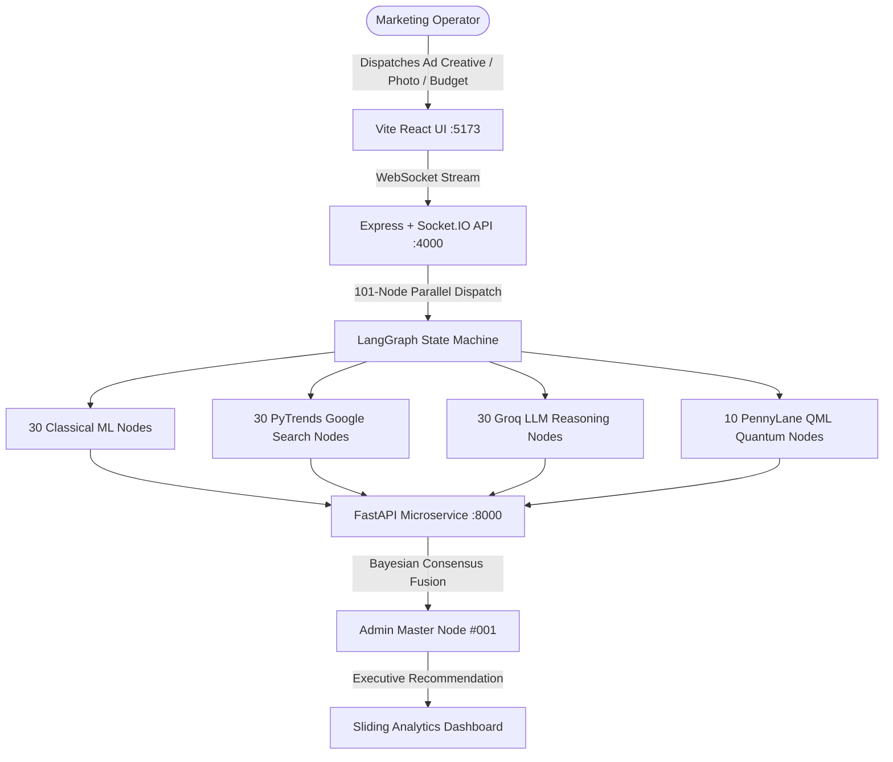

# Margent

> **101-Node Quantum-Classical Multi-Modal Autonomous Marketing Intelligence Platform**  
> Bridging PennyLane Variational Quantum Circuits, Supervised Classical ML, Real-Time Google PyTrends, and Groq LLM Qualitative Reasoning into unified Bayesian Executive Consensus.

---

## Architecture Overview



---

## 30-30-30-10 Multi-Modal Intelligence Ensemble

1. **30 Classical Machine Learning Nodes (`ml_001` → `ml_030`)**:
   - RandomForest Regressors for predicted Return on Ad Spend (ROAS) and conversion rates.
   - KMeans 5-cluster customer segmentation & IsolationForest anomaly detection.
2. **30 PyTrends Google Search Nodes (`pytrend_001` → `pytrend_030`)**:
   - 90-day search volume interest curves, growth momentum, and keyword breakout velocity.
3. **30 Groq LLM Qualitative Nodes (`groq_001` → `groq_030`)**:
   - Groq LLaMA 3.3 70B & xAI Grok structured persona reasoning, copy critique, and hook evaluation.
4. **10 PennyLane QML Quantum Nodes (`qml_001` → `qml_010`)**:
   - 4-Qubit Variational Quantum Circuits in Hilbert Space computing Pauli-Z expectation $\langle \sigma_z \rangle$ and multi-feature quantum entanglement.
5. **1 Master Admin Orchestrator Node (`admin_001`)**:
   - Bayesian Multi-Modal Consensus Aggregator issuing executive decisions (`SCALE`, `MAINTAIN`, `INVESTIGATE`, `STOP`).

---

## Quickstart Guide

### 1. Environment Setup
```powershell
# Create & Activate Conda Environment (Python 3.11)
conda create -n margent-ml python=3.11 -y
conda activate margent-ml

# Install Dependencies
pip install fastapi uvicorn pandas numpy scikit-learn joblib pydantic pytrends groq pennylane pennylane-lightning
npm install
```

### 2. Configure Environment Variables
Copy `.env.example` to `.env`:
```powershell
cp .env.example .env
cp ml/.env.example ml/.env
cp apps/api/.env.example apps/api/.env
```
*(Optional: Add your free Groq API key from [https://console.groq.com/keys](https://console.groq.com/keys) in `ml/.env`).*

### 3. One-Click Node Training
```powershell
conda run -n margent-ml python datasets/train_nodes.py
```

### 4. Launch Services
Run each command in a separate terminal:
```powershell
# Terminal 1: Python FastAPI ML Microservice (Port 8000)
conda run -n margent-ml uvicorn ml.app.main:app --host 127.0.0.1 --port 8000

# Terminal 2: Node.js Express & Socket.IO API (Port 4000)
npx tsx apps/api/src/server.ts

# Terminal 3: Vite React Web Visualizer (Port 5173)
npm --prefix apps/web run dev
```

Open **[http://127.0.0.1:5173](http://127.0.0.1:5173)** in your browser.

---

## Automated Validation Test

Run the full end-to-end integration test suite:
```powershell
npx tsx scripts/test-campaign-flow.ts
```

---

## Documentation Index
- [`todo.md`](./todo.md): Operator setup checklist and manual dataset ingestion guide.
- [`root.md`](./root.md): Master system overview and mathematical formulation.
- [`issue.md`](./issue.md): Codebase architectural audit and library replacements.
- [`uiissue.md`](./uiissue.md): UI/UX design tokens and Swiss typographic specification.
- [`documentation/ARCHITECTURE.md`](./documentation/ARCHITECTURE.md): Deep-dive system architecture.
- [`documentation/API_REFERENCE.md`](./documentation/API_REFERENCE.md): REST & WebSocket API specification.
