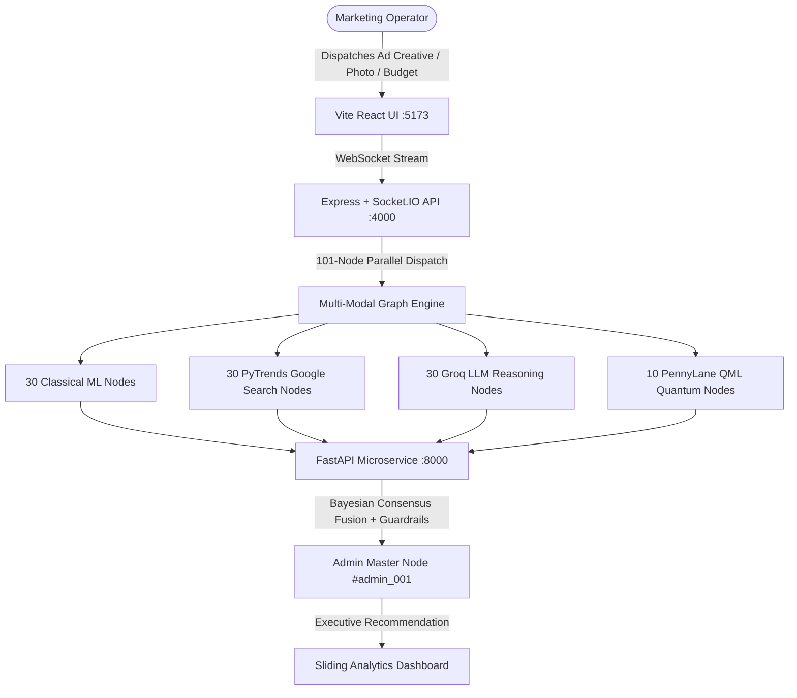

# Margent

> **101-Node Quantum-Classical Multi-Modal Autonomous Marketing Intelligence Platform**  
> Bridging PennyLane Variational Quantum Circuits, Supervised Classical ML, Real-Time Google PyTrends, and Groq LLM Qualitative Reasoning into unified Bayesian Executive Consensus.

---

## 1. System Architecture



---

## 2. 30-30-30-10 Multi-Modal Intelligence Ensemble (`guide.md` Section 7)

$$\text{final\_score} = 0.30 \cdot \text{grok\_score} + 0.30 \cdot \text{qml\_score} + 0.30 \cdot \text{simple\_score} + 0.10 \cdot \text{rule\_score}$$

1. **30 Classical Machine Learning Nodes (`ml_001` → `ml_030`)**:
   - `ChannelAnalyzer` (#1–10): `GradientBoosting` & `RandomForest` ROAS regression across channels.
   - `ModelEnsembleAgent` (#11–20): `KMeans` 5-cluster customer segmentation.
   - `RootCauseAgent` (#21–30): `IsolationForest` CPA drift and CTR anomaly detection.
2. **30 PyTrends Google Search Nodes (`pytrend_001` → `pytrend_030`)**:
   - `TrendAgent` (#1–30): 90-day search volume interest curves, growth momentum, and keyword breakout velocity.
3. **30 Groq LLM Qualitative Nodes (`groq_001` → `groq_030`)**:
   - `RecommenderAgent` (#1–30): Groq `LLaMA 3.3 70B` structured persona reasoning, copy critique, and hook evaluation.
4. **10 PennyLane QML Quantum Nodes (`qml_001` → `qml_010`)**:
   - `QuantumVQC` (#1–10): 4-Qubit Variational Quantum Circuits in Hilbert Space computing Pauli-Z expectation $\langle \sigma_z(0) \rangle$ and multi-feature quantum entanglement.
5. **1 Master Admin Orchestrator Node (`admin_001`)**:
   - `AdminOrchestrator`: Bayesian Multi-Modal Consensus Aggregator issuing executive decisions (`SCALE`, `MAINTAIN`, `INVESTIGATE`, `STOP`).

---

## 3. Quickstart Guide

### 1. Environment Setup
```powershell
# Create & Activate Conda Environment (Python 3.11)
conda create -n margent-ml python=3.11 -y
conda activate margent-ml

# Install Dependencies
pip install fastapi uvicorn pandas numpy scikit-learn joblib pydantic pytrends groq pennylane pennylane-lightning
npm install
```

### 2. Configure Environment Variables
Copy `.env.example` to `.env`:
```powershell
cp .env.example .env
cp ml/.env.example ml/.env
cp apps/api/.env.example apps/api/.env
```
*(Optional: Add your free Groq API key in `ml/.env`).*

### 3. One-Click Node Training
```powershell
conda run -n margent-ml python datasets/train_nodes.py
```

### 4. Launch Services
Run each command in a separate terminal:
```powershell
# Terminal 1: Python FastAPI ML Microservice (Port 8000)
conda run -n margent-ml uvicorn ml.app.main:app --host 127.0.0.1 --port 8000

# Terminal 2: Node.js Express & Socket.IO API (Port 4000)
npx tsx apps/api/src/server.ts

# Terminal 3: Vite React Web Visualizer (Port 5173)
npm --prefix apps/web run dev
```

Open **[http://127.0.0.1:5173](http://127.0.0.1:5173)** in your browser.

---

## 4. Documentation & Guides

- **[System Architecture Guide (`guide.md`)](guide.md)**: Master architectural specifications, compliance standards, and ensemble formulations.
- **[Model Training Manual (`train.md`)](train.md)**: Dataset schemas, feature engineering equations, and training commands.
- **[Monorepo Architecture Overview (`root.md`)](root.md)**: Directory layout, component relationships, and navigation.
- **[Deep Technical Architecture (`documentation/ARCHITECTURE.md`)](documentation/ARCHITECTURE.md)**: State machine execution cycles and super-steps.
- **[API Reference (`documentation/API_REFERENCE.md`)](documentation/API_REFERENCE.md)**: REST endpoints, validation schemas, and WebSocket events.
- **[Operator Setup Checklist (`setup.md`)](setup.md)**: Environment setup and credential management.
