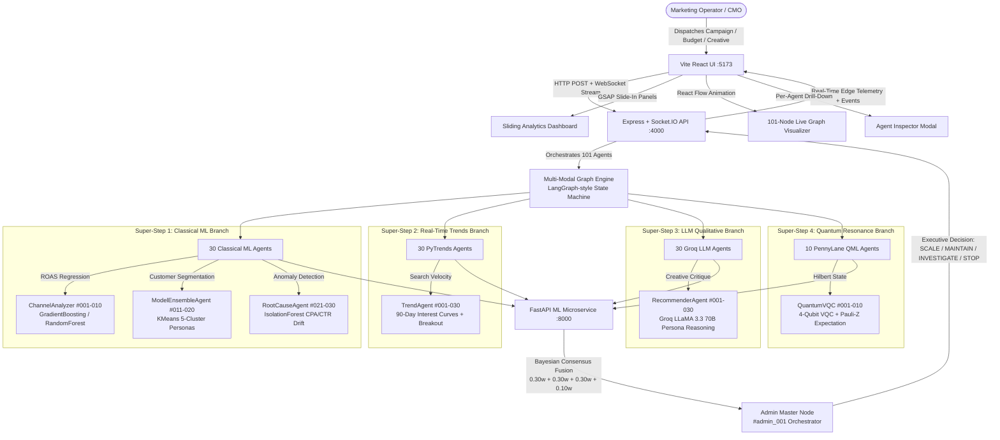

# Margent

> **101-Node Quantum-Classical Multi-Modal Autonomous Marketing Intelligence Platform**
> Bridging PennyLane Variational Quantum Circuits, Supervised Classical ML, Real-Time Google PyTrends, and Groq LLM Qualitative Reasoning into unified Bayesian Executive Consensus.

---

## Problem Statement

### Marketing Teams Struggled to Understand Campaign Performance

**Problem:** Marketing teams ran campaigns across multiple channels, but performance data was often spread across different dashboards. Teams spent significant time trying to understand what was actually working.

**Build:** An AI agent that analyzes campaign performance data, identifies winning and underperforming campaigns, explains possible reasons behind the results, and recommends where the marketing team should focus next.

---

## Our Solution

**Margent** is an autonomous multi-agent marketing intelligence and campaign optimization platform that transforms scattered cross-channel performance data into clear, actionable executive decisions. Powered by a **101-Node Quantum-Classical Multi-Modal Ensemble**, Margent:

- **Ingests & Harmonizes** campaign data across Instagram, Facebook, Pinterest, Twitter, Google Ads, and TikTok from 5+ licensed datasets into one normalized view.
- **Analyzes at Scale** using 30 Classical ML nodes (GradientBoosting, RandomForest, KMeans, IsolationForest) for ROAS regression, customer segmentation, and anomaly detection.
- **Incorporates Real-Time Signals** from 30 PyTrends Google Search nodes tracking 90-day search volume interest curves, growth momentum, and keyword breakout velocity.
- **Reasons Qualitatively** via 30 Groq LLaMA 3.3 70B nodes for copywriting critique, hook resonance evaluation, and persona-based sentiment analysis.
- **Computes Quantum Resonance** through 10 PennyLane 4-Qubit Variational Quantum Circuits in Hilbert Space, measuring Pauli-Z expectation values and multi-feature quantum entanglement.
- **Synthesizes Executive Consensus** via a Bayesian Admin Orchestrator that fuses all signals into ranked decisions: **SCALE**, **MAINTAIN**, **INVESTIGATE**, or **STOP** — with plain-English root-cause explanations.

The final score is computed through a weighted multi-modal ensemble:
$$\text{final\_score} = 0.30 \cdot \text{grok\_score} + 0.30 \cdot \text{qml\_score} + 0.30 \cdot \text{simple\_score} + 0.10 \cdot \text{rule\_score}$$

All of this is visualized in a real-time React Flow graph with a sliding analytics dashboard, live event stream, and agent inspector modal.

---

## Target Users

| User Persona | Role & Pain Point | How Margent Helps |
|---|---|---|
| **CMO / Marketing Director** | Needs a single executive view of cross-channel ROI to justify budget. | Delivers one Bayesian consensus score per campaign with ranked SCALE/STOP decisions, no dashboard hopping. |
| **Growth Marketing Manager** | Spends hours each day manually comparing Meta, Google, and TikTok dashboards without clear answers. | Automatically identifies top & bottom performers, explains *why* with root-cause hypotheses, and recommends next steps. |
| **Performance Marketing Specialists** | Struggles to isolate which creative, channel, or audience segment is actually driving conversions. | 5-cluster KMeans customer segmentation + CTR/CPA drift anomaly detection pinpoints exact problem areas. |
| **Brand & Content Strategists** | Wants to know which hooks and copy angles are resonating beyond just engagement numbers. | Groq LLM nodes deliver structured persona-based copy critique and hook resonance scoring. |
| **Data Analysts / BI Teams** | Tired of building dashboards that no one interprets correctly. | Multi-modal ensemble output is pre-aggregated, normalized, and ready for boardroom consumption with built-in rule guardrails. |
| **Startup Founders / Solo Operators** | Cannot afford an enterprise marketing analytics suite but still needs data-driven decisions. | Zero-cost open-source stack runs on free-tier APIs (Groq) with local QML simulation — no licensing fees. |

---

## Unique Selling Points (USPs)

1. **Single Source of Truth Across Channels** — Instagram, Facebook, Pinterest, Twitter, TikTok, and Google Ads merged into one normalized canonical schema instead of siloed native dashboards. Each campaign is scored on a universal scale regardless of origin.

2. **Explains "Why," Not Just "What"** — A dedicated `RootCauseAgent` (10 IsolationForest anomaly nodes) turns raw ROAS and CTR numbers into plain-English causal hypotheses instead of leaving interpretation to the reader. Teams stop guessing and start acting.

3. **Action, Not Just Analysis** — Output is ranked next-step recommendations with executive-level decisions (`SCALE`, `MAINTAIN`, `INVESTIGATE`, `STOP`), not another dashboard full of charts that nobody reads.

4. **101-Node Quantum-Classical Multi-Modal Ensemble** — The only free/open-source platform that combines: Classical GradientBoosting ML (30 nodes) + Real-Time Google PyTrends signals (30 nodes) + Groq LLaMA 3.3 70B qualitative reasoning (30 nodes) + PennyLane 4-Qubit Variational Quantum Circuits (10 nodes) + 1 Bayesian Admin Orchestrator. No single-model bias.

5. **Fully Compliant Data Sources** — Official free-tier APIs and 5 licensed Kaggle benchmark datasets only. No scraping, no fake engagement bots, no Meta Platform Terms violations. Everything runs on data you own or are explicitly licensed to use.

6. **Free to Run at Small Scale** — Groq free-tier API key, local PennyLane quantum simulator, open-source LangGraph-compatible orchestration, Vite + React UI. Zero mandatory cloud costs.

7. **Extensible Agent Architecture** — New channels (TikTok, LinkedIn Ads, Snap) are new worker agents dropped into the `packages/agents/` directory — not a full rebuild. The 101-node graph scales horizontally without changing the orchestrator.

8. **Real-Time Interactive Visualizer** — React Flow graph animates all 101 nodes executing in 4 parallel super-steps, with a GSAP sliding dashboard, live WebSocket event stream, and per-agent inspector modal. Stakeholders see the AI *think*, not just the final answer.

---

## Architecture



### 101-Agent Distribution Matrix

| Pipeline Segment | Count | Roles | Engine | Key Metrics |
|---|:---:|---|---|---|
| **Classical ML** | **30** | `ChannelAnalyzer` (1–10), `ModelEnsembleAgent` (11–20), `RootCauseAgent` (21–30) | GradientBoosting, RandomForest, KMeans, IsolationForest | ROAS regression, 5-persona segmentation, CPA/CTR anomaly drift |
| **PyTrends Signals** | **30** | `TrendAgent` (1–30) | Google PyTrends API + Velocity Engine | 90-day interest curves, breakout indicators, growth momentum |
| **Groq / LLM** | **30** | `RecommenderAgent` (1–30) | Groq LLaMA 3.3 70B Versatile | Copy critique, hook resonance, persona sentiment |
| **PennyLane QML** | **10** | `QuantumVQC` (1–10) | PennyLane 4-Qubit VQC (local simulator) | Pauli-Z ⟨σ_z(0)⟩, multi-feature entanglement |
| **Admin Master** | **1** | `AdminOrchestrator` (#001) | Bayesian Multi-Modal Consensus | Final score + SCALE/MAINTAIN/INVESTIGATE/STOP |
| **Total** | **101** | | | |

---

## Setup & How to Run

### Prerequisites

1. **Node.js** v18+ (for the API server and Web UI)
2. **Miniconda** or **Anaconda** (for Python 3.11 ML/QML environment)
3. **Git** (to clone the repo)
4. **Groq API Key** (free tier: [console.groq.com/keys](https://console.groq.com/keys)) — optional but recommended for LLM reasoning

---

### Step 1: Clone & Install Dependencies

```powershell
# Clone the repository
git clone <repository-url>
cd Margent

# 1. Create & activate Python 3.11 conda environment
conda create -n ai-product-hackathon python=3.11 -y
conda activate ai-product-hackathon

# 2. Install Python ML, Quantum, and FastAPI dependencies
pip install -r ml/requirements.txt
# Or manually (includes all optional packages):
pip install fastapi uvicorn pandas numpy scikit-learn joblib pydantic pytrends groq pennylane pennylane-lightning

# 3. Install Node.js workspace dependencies (root + apps/api + apps/web)
npm install
```

---

### Step 2: Configure Environment Variables

Copy the `.env.example` templates and fill in your keys:

```powershell
# Root environment
cp .env.example .env

# Python ML microservice
cp ml/.env.example ml/.env

# Node.js API server
cp apps/api/.env.example apps/api/.env
```

> **Critical:** Open `ml/.env` and paste your Groq API key for LLM reasoning nodes:
> ```
> GROQ_API_KEY=gsk_your_free_groq_key_here
> ```
> *(Optional)* Add an `XAI_API_KEY` in both `ml/.env` and `.env` if you have an xAI Grok key.

---

### Step 3: Train the 101 Ensemble Nodes

Generate all serialized `.joblib` models for the Classical ML and QML branches before first run:

```powershell
# Trains 30 Classical ML nodes + 10 QML VQC nodes
conda run -n ai-product-hackathon python datasets/train_nodes.py
```

Trained models are output to `ml/models/` (anomaly_model, campaign_model, qml_model, segmentation_model).

---

### Step 4: Launch the Full Stack

#### Option A — Unified One-Click Launcher (Recommended)

Runs all three services concurrently in one terminal with colored prefixes:

```powershell
npm run dev
```

This automatically launches:
- 🔴 **ML Microservice** — FastAPI on `http://127.0.0.1:8000`
- 🟣 **API Server** — Express + Socket.IO on `http://127.0.0.1:4000`
- 🟢 **Web Visualizer** — Vite + React on `http://127.0.0.1:5173`

#### Option B — Separate Terminals (For Debugging)

Open **three terminals** and run each service individually:

**Terminal 1 — Python FastAPI ML Microservice (Port 8000):**
```powershell
conda activate ai-product-hackathon
uvicorn ml.app.main:app --host 127.0.0.1 --port 8000 --reload
```

**Terminal 2 — Node.js Express & Socket.IO API (Port 4000):**
```powershell
npx tsx apps/api/src/server.ts
# Or using the workspace script:
npm --prefix apps/api run dev
```

**Terminal 3 — Vite React Web Visualizer (Port 5173):**
```powershell
npm --prefix apps/web run dev
```

---

### Step 5: Open the App & Run a Campaign Analysis

1. Navigate to **[http://127.0.0.1:5173](http://127.0.0.1:5173)** in your browser.
2. Use the **Campaign Form** to submit a campaign (channel, budget, creative, target audience, hashtags).
3. Watch the **101-node React Flow graph** animate as all 4 super-steps execute in parallel:
   - Super-Step 1: Classical ML nodes light up yellow
   - Super-Step 2: PyTrends nodes fetch real Google search data (blue)
   - Super-Step 3: Groq LLM nodes critique the creative (purple)
   - Super-Step 4: PennyLane QML nodes compute quantum resonance (cyan)
4. The **Admin Orchestrator** (#admin_001) fuses all signals and delivers the final verdict.
5. Slide open the **Analytics Dashboard** for charts and ranked recommendations, or click any node to open the **Agent Inspector Modal** for per-agent telemetry.

---

### Step 6: Verify End-to-End Flow (Optional)

Run the automated integration test to confirm the full LangGraph state machine works:

```powershell
npx tsx scripts/test-campaign-flow.ts
```

---

## Documentation & Guides

- **[Full Build & Training Guide (`guide.md`)](guide.md)** — USP deep-dive, MVP scope, 7-day plan, ensemble math, PyTrends integration.
- **[Model Training Manual (`train.md`)](train.md)** — Dataset schemas, feature engineering equations, per-model training commands.
- **[Monorepo Overview (`root.md`)](root.md)** — Directory layout, component relationships, navigation map.
- **[Deep Technical Architecture (`documentation/ARCHITECTURE.md`)](documentation/ARCHITECTURE.md)** — State machine execution cycles, super-step sequencing, fusion math.
- **[API Reference (`documentation/API_REFERENCE.md`)](documentation/API_REFERENCE.md)** — REST endpoints, Zod validation schemas, WebSocket event contracts.
- **[Operator Setup Checklist (`setup.md`)](setup.md)** — Environment setup, credential management, troubleshooting.
