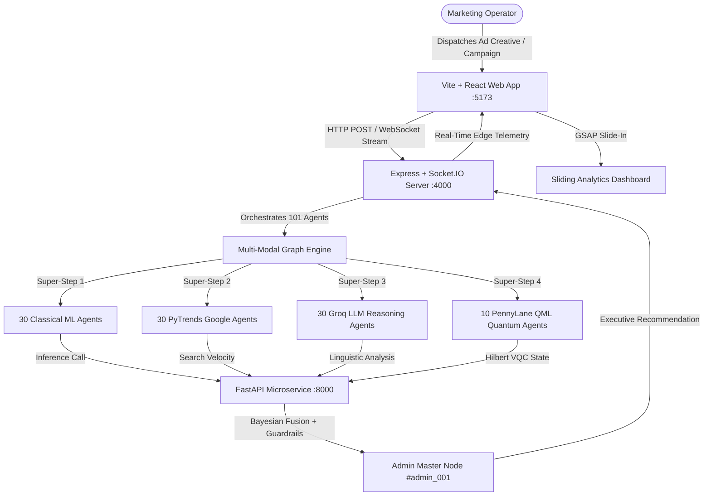

# System Architecture & Technical Specifications

> **Margent** is an autonomous marketing intelligence and campaign optimization platform powered by a **101-Node Quantum-Classical Multi-Modal Ensemble**. It bridges quantum variational circuits in Hilbert space, supervised statistical ML models, real-time Google search trends, and qualitative LLM reasoning.

---

## 1. High-Level System Architecture

---

## 2. 101-Agent Multi-Modal Distribution Matrix (`guide.md` Section 3)

| Pipeline Segment | Agent Count | Specific Agent Roles | Engine / Library | Purpose & Metrics |
| :--- | :---: | :--- | :--- | :--- |
| **Margent ChannelPulse** | **30** | `ChannelAnalyzer` (1–10) `ModelEnsembleAgent` (11–20) `RootCauseAgent` (21–30) | `GradientBoostingClassifier` `RandomForestRegressor` `KMeans` `IsolationForest` | Evaluates channel performance, clusters consumer profiles into 5 personas, and detects CPA/CTR anomaly drifts. |
| **Margent TrendRadar** | **30** | `TrendAgent` (1–30) | Google Trends API + Velocity Engine | Computes 90-day search interest curves, breakout query indicators, and growth velocity. |
| **Margent CreativeMind** | **30** | `RecommenderAgent` (1–30) | Groq `LLaMA 3.3 70B Versatile` | Copywriting critique, hook resonance, and customer perspective sentiment. |
| **Margent QuantumSignal** | **10** | `QuantumVQC` (1–10) | PennyLane 4-Qubit Variational Quantum Circuit | Pauli-Z expectation $\langle \sigma_z(0) \rangle$, multi-feature quantum entanglement matrix. |
| **Margent DecisionCore** | **1** | `AdminOrchestrator` (`admin_001`) | Multi-Modal Weighted Consensus Orchestrator | Weighted multi-objective executive decision (`SCALE`, `MAINTAIN`, `INVESTIGATE`, `STOP`). |

---

## 3. Mathematical Consensus Formulation (`guide.md` Section 7)

$$\text{consensus\_score} = 0.35 \cdot \text{ChannelPulse} + 0.25 \cdot \text{TrendRadar} + 0.25 \cdot \text{CreativeMind} + 0.15 \cdot \text{QuantumSignal}$$

### Pipeline Component Formulations:
1. **Margent ChannelPulse ($\text{ChannelPulse}$)**:
   $$\text{ROAS}_{\text{ChannelPulse}} = \text{Regressor}(\mathbf{X})$$
2. **Margent TrendRadar ($\text{TrendRadar}$)**:
   $$\text{ROAS}_{\text{TrendRadar}} = 1.00 + \left(\frac{\text{Velocity}}{100}\right) \cdot 3.50$$
3. **Margent CreativeMind ($\text{CreativeMind}$)**:
   $$\text{ROAS}_{\text{CreativeMind}} = 1.00 + \left(\frac{\text{Creative Score}}{100}\right) \cdot 3.00$$
4. **Margent QuantumSignal ($\text{QuantumSignal}$)**:
   $$\langle \sigma_z(0) \rangle = \langle \psi(\theta, \mathbf{x}) | \sigma_z | \psi(\theta, \mathbf{x}) \rangle$$

---

## 4. Multi-Dataset Ingestion Architecture

Ingests and harmonizes 5 Kaggle multi-channel datasets in `datasets/`:
1. `datasets/Social Media Advertising Dataset-kaggle/` (300,000 campaigns across Instagram, Facebook, Pinterest, Twitter).
2. `datasets/Advertising Campaign Dataset/` (Croissant metadata + user engagement metrics).
3. `datasets/Marketing Campaign dataset/` (Multi-channel ad delivery).
4. `datasets/Social Media Ad Dataset-kaggle/` (Ad optimization metrics).
5. `datasets/Social Media Advertisement Performance-kaggle/` (Relational campaigns & ads).
