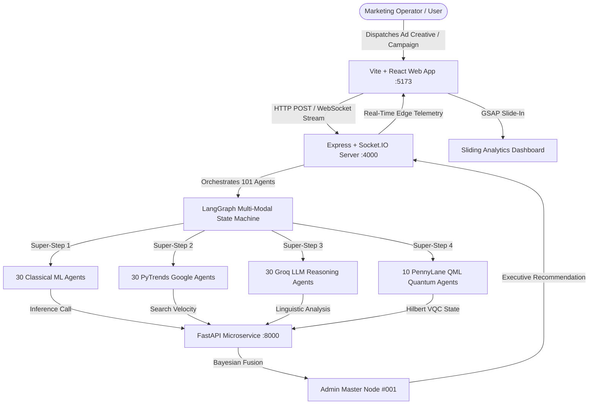

# System Architecture & Technical Specifications

**Margent** is an autonomous AI marketing intelligence platform powered by a **101-Node Quantum-Classical Multi-Modal Ensemble**. It bridges quantum variational circuits in Hilbert space, supervised statistical ML models, real-time Google search trends, and qualitative LLM reasoning.

---

## 1. High-Level System Architecture



---

## 2. 101-Agent Multi-Modal Distribution Matrix

| Pipeline Segment | Agent Count | Engine / Library | Purpose & Metrics |
| :--- | :---: | :--- | :--- |
| **Classical ML** | **30** | Scikit-Learn RandomForest + KMeans | ROAS regression, conversion rate, CPC anomaly detection. |
| **PyTrends Signals** | **30** | Google Trends API + Velocity Engine | 90-day search interest curve, breakout keywords, growth momentum. |
| **Groq / Grok LLM** | **30** | Groq LLaMA 3.3 70B & xAI Grok | Copywriting critique, hook resonance, customer perspective sentiment. |
| **PennyLane QML** | **10** | PennyLane 4-Qubit Variational Quantum Circuit | Pauli-Z expectation $\langle \sigma_z \rangle$, multi-feature quantum entanglement matrix. |
| **Admin Master** | **1** | Bayesian Multi-Modal Consensus Aggregator | Weighted multi-objective executive decision (`SCALE`, `MAINTAIN`, `STOP`). |

---

## 3. Directory Layout

```
margent/
├── apps/
│   ├── api/                    # Express + Socket.IO Server (Port 4000)
│   └── web/                    # React 18 + React Flow + GSAP Visualizer (Port 5173)
├── ml/                         # Python ML & Quantum Microservice (Port 8000)
│   ├── app/                    # FastAPI endpoints & inference services
│   ├── models/                 # Serialized .joblib artifacts
│   └── training/               # Standalone training modules
├── packages/
│   ├── shared/                 # TypeScript types, constants, metrics
│   ├── agents/                 # 101 Agent Registry & Persona generators
│   └── graph/                  # LangGraph state machine & super-step orchestration
├── datasets/                   # User-dropped CSVs & 1-Click training script
├── documentation/              # Architecture & API specifications
└── scripts/                    # End-to-end testing & validation suites
```
