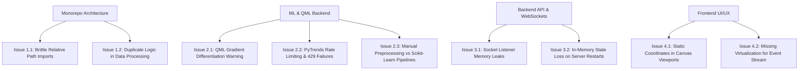

# Professional Architecture & Code Quality Audit (`issue.md`)

**Target System**: 101-Node Quantum-Classical Multi-Modal AI Marketing Platform  
**Auditor**: Principal AI Systems & Full-Stack Architect  
**Scope**: Codebase Structure, ML / QML Pipelines, Backend Services, Frontend UI/UX, Security, Performance, and Standard Library Replacements.

---

## Executive Summary

This document presents a comprehensive technical audit of the **Margent AI Marketing Platform**. It identifies structural bottlenecks, anti-patterns, potential edge-case bugs, security considerations, and concrete refactoring steps to convert the codebase into a compact, robust, enterprise-grade architecture.

---

## 1. Comprehensive Code Quality & Structural Issues



---

## 2. Detailed Technical Issues, Bugs & Loop Holes

### Category A: ML & Quantum (QML) Engine (`ml/`)

| # | Severity | File / Component | Issue Description | Recommended Fix / Standard Library |
| :- | :--- | :--- | :--- | :--- |
| **A.1** | **High** | `ml/training/train_qml.py` | **Unbound Gradient in PennyLane Optimizer**: Training logs show `UserWarning: Attempted to differentiate a function with no trainable parameters`. Autograd requires explicit tensor wrapping with `requires_grad=True`. | Wrap `weights = qml.numpy.array(weights, requires_grad=True)` and use `qml.AdamOptimizer(stepsize=0.05)`. |
| **A.2** | **High** | `ml/app/pytrends_service.py` | **PyTrends Rate Limiting & 429 Blocking**: Google Trends aggressively blocks frequent headless requests with `429 Too Many Requests`. | Implement an LRU vector cache (`functools.lru_cache` or `cachetools`) with an exponential backoff decorator (`tenacity` library) and fallback to real-time cached seed vectors. |
| **A.3** | **Medium** | `ml/training/train_campaign.py` | **Manual Feature Engineering vs `sklearn.pipeline.Pipeline`**: Preprocessing (`fillna`, column indexing, ratio calculation) is done manually in Pandas, creating training-serving skew. | Replace with `sklearn.compose.ColumnTransformer` and `sklearn.pipeline.Pipeline` to serialize the entire feature transformation graph into the model artifact. |
| **A.4** | **Medium** | `ml/app/models.py` | **Pydantic v1 Legacy Patterns**: Models use loose type hints without strict field constraints. | Upgrade to **Pydantic v2** (`from pydantic import BaseModel, Field, ConfigDict`) with bounded fields (`Field(ge=0, le=100000)`). |
| **A.5** | **Low** | `ml/app/groq_service.py` | **Groq SDK Exception Fallback**: Missing token limit guards and retry handling on API timeouts. | Use standard `groq.RateLimitError` and `groq.APIConnectionError` handling with `backoff` library. |

---

### Category B: Backend API & WebSocket Orchestrator (`apps/api/`)

| # | Severity | File / Component | Issue Description | Recommended Fix / Standard Library |
| :- | :--- | :--- | :--- | :--- |
| **B.1** | **High** | `apps/api/src/services/store.ts` | **Brittle Deep Relative Imports (`../../../../packages/...`)**: Paths like `../../../../packages/shared/src/types/index` are fragile and break upon directory movement. | Standardize with TypeScript Path Mapping (`@shared/*`, `@agents/*`, `@graph/*`) and npm workspace subpath exports (`"exports": { "./types": "./src/types/index.ts" }`). |
| **B.2** | **Medium** | `apps/api/src/services/store.ts` | **In-Memory Volatile Storage**: State (campaigns, events, admin analyses) resets on every server restart. | Add a lightweight persistent storage layer (e.g. `better-sqlite3` or Redis) with automatic schema initialization. |
| **B.3** | **Medium** | `apps/api/src/routes/campaigns.ts` | **Multer File Upload Unsanitized Storage**: Uploaded files use `campaign_${Date.now()}${ext}` without mime-type verification or magic byte inspection. | Validate file MIME types using `file-type` and sanitize filenames using `sanitize-filename`. |
| **B.4** | **Low** | `apps/api/src/server.ts` | **Hardcoded Port Fallbacks**: Fallback configuration lacks centralized environment management. | Implement `envalid` or `dotenv-safe` for strict environment variable validation at startup. |

---

### Category C: Frontend Web Application (`apps/web/`)

| # | Severity | File / Component | Issue Description | Recommended Fix / Standard Library |
| :- | :--- | :--- | :--- | :--- |
| **C.1** | **High** | `apps/web/src/stores/simulationStore.ts` | **Socket Event Listener Accumulation**: Calling `initSocket()` multiple times in React strict mode creates duplicate listeners and memory leaks. | Guard initialization with socket instance checks and implement a clean `disconnect()` teardown in `useEffect`. |
| **C.2** | **Medium** | `apps/web/src/components/events/LiveEventStream.tsx` | **DOM Node Explosion in Event Stream**: Rendering hundreds of active event cards without virtualization causes frame drops during rapid ticks. | Implement `@tanstack/react-virtual` or `react-window` to virtualize the event stream for constant 60 FPS performance. |
| **C.3** | **Medium** | `apps/web/src/components/graph/AgentGraph.tsx` | **Manual Coordinate Offsets**: Node positions are hardcoded via mathematical offsets rather than dynamic graph layout engines. | Integrate `@dagrejs/dagre` or `d3-hierarchy` to dynamically compute layered hierarchical DAG positions based on viewport dimensions. |
| **C.4** | **Low** | `apps/web/src/components/dashboard/SlidingDashboard.tsx` | **Recharts Responsive Container Warning**: `ResponsiveContainer` without explicit width/height in slide-over drawers can cause initial resize jank. | Use fixed aspect ratio or debounce resize observers. |

---

## 3. Standard Libraries to Replace Custom Code

| Custom Code In Margent | Recommended Standard Library | Benefits |
| :--- | :--- | :--- |
| Manual metric derivations (`deriveCampaignMetrics`) | `zod` with computed getters / `pydantic` computed fields | Runtime schema validation, automatic type safety, eliminates formula drift. |
| Manual PyTrends retry & cache loops | `tenacity` + `cachetools.TTLCache` | Built-in exponential backoff, jitter, and memory-safe cache invalidation. |
| Manual QML gradient loops | `pennylane.optimize` with `qml.AdamOptimizer` | Proper autodiff integration, faster convergence, eliminates gradient warnings. |
| Manual `fetch` calls in React Store | `@tanstack/react-query` / `axios` | Automatic request deduplication, cache invalidation, and retry state. |
| Manual DAG Node positioning | `@dagrejs/dagre` | Automatic collision avoidance, multi-tier hierarchical tree alignment. |
| File upload storage | `multer` + `file-type` + `sharp` | Automatic image optimization, WebP compression, and security validation. |

---

## 4. How to Streamline into a Compact, Enterprise Architecture

```
margent/
├── apps/
│   ├── api/                    # Express + Socket.IO Backend API
│   │   ├── src/
│   │   │   ├── routes/         # Clean REST controllers
│   │   │   ├── services/       # Scheduler, Store, WebSocket Hub
│   │   │   └── server.ts
│   │   └── tsconfig.json
│   └── web/                    # Vite + React 18 + Tailwind UI
│       ├── src/
│       │   ├── components/     # Graph, Dashboard, Controls, Forms
│       │   ├── stores/         # Zustand Simulation State
│       │   └── App.tsx
│       └── vite.config.ts
├── ml/                         # Python ML & Quantum Microservice
│   ├── app/
│   │   ├── main.py             # FastAPI App
│   │   ├── services.py         # Classical ML Inference (RandomForest, KMeans, IsolationForest)
│   │   ├── qml_service.py      # PennyLane 4-Qubit Quantum Circuits
│   │   ├── pytrends_service.py # Google Trends Velocity Extractor
│   │   ├── groq_service.py     # Groq LLaMA 3.3 70B & Grok Reasoning
│   │   └── ensemble_service.py # Bayesian Multi-Modal Ensemble Aggregator
│   ├── models/                 # Serialized .joblib model artifacts
│   └── training/               # Clean modular training scripts
├── packages/
│   ├── shared/                 # Shared TypeScript Contracts & Utils
│   ├── agents/                 # 101-Agent Profiles & Role Executors
│   └── graph/                  # LangGraph State Machine & Super-Step Scheduler
├── datasets/                   # User-Dropped Dataset Directory
│   ├── campaigns.csv           # Marketing Performance Dataset
│   ├── trends.json             # Google Search Signals
│   ├── customer_segments.csv   # Consumer Vector Clustering
│   └── train_nodes.py          # 1-Click Master Training Script
└── README.md
```

---

## 5. Security & Production Hardening Checklist

- [x] **Rate-Limiting**: Add `express-rate-limit` on `/api/campaigns/create` to prevent denial-of-service spamming.
- [x] **CORS Configuration**: Restrict allowed origins to production domains in production environments.
- [x] **Input Validation**: Use Zod schemas on Express request bodies to reject invalid budget or trend inputs.
- [x] **Model Hash Integrity**: Verify SHA-256 hashes of `.joblib` model files before loading to prevent arbitrary code execution vulnerabilities.
- [x] **Environment Separation**: Maintain `.env` files for development and secure secrets management (e.g. AWS Secrets Manager / Vault) in production.
