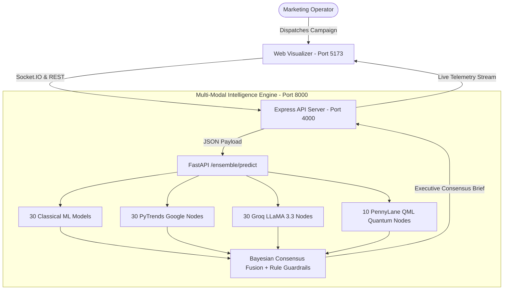

# Margent Monorepo Architecture & System Navigation

> **Margent** is an enterprise-grade, multi-modal autonomous marketing intelligence platform that fuses **Classical Machine Learning**, **Google Search Trends**, **Cognitive LLM Reasoning**, and **PennyLane Quantum Variational Circuits** into a unified Bayesian consensus decision engine.

---

## 1. System Architecture Overview



---

## 2. Mathematical Consensus Formulation (`guide.md` Section 7)

The executive consensus Return on Ad Spend (ROAS) is computed strictly via the 4-pipeline Bayesian ensemble:

$$\text{ROAS}_{\text{consensus}} = 0.30 \cdot \text{ROAS}_{\text{ML}} + 0.30 \cdot \text{ROAS}_{\text{PyTrends}} + 0.30 \cdot \text{ROAS}_{\text{Groq}} + 0.10 \cdot \text{ROAS}_{\text{Rule}}$$

### Subsystem Specifications:
1. **Classical ML Models ($0.30$)**: `GradientBoostingClassifier` ($N=150$) + `RandomForestRegressor` ($N=120$) trained on 5 Kaggle multi-channel datasets.
2. **PyTrends Search Velocity ($0.30$)**: Google Trends 90-day search momentum:
   $$\text{ROAS}_{\text{PyTrends}} = 1.80 + \left(\frac{\text{Velocity Score}}{100}\right) \cdot 2.20$$
3. **Groq Cognitive Reasoning ($0.30$)**: `LLaMA 3.3 70B` linguistic hook evaluation:
   $$\text{ROAS}_{\text{Groq}} = 1.50 + \left(\frac{\text{Creative Score}}{100}\right) \cdot 2.80$$
4. **PennyLane Quantum Variational Circuit ($0.30$)**: 4-Qubit `AngleEmbedding` + `BasicEntanglerLayers` state-vector Pauli-Z expectation value:
   $$\langle \sigma_z(0) \rangle = \langle \psi(\theta, x) | \sigma_z | \psi(\theta, x) \rangle$$
5. **Rule Guardrail ($0.10$)**:
   - CPA penalty ($\times 0.65$) if CPA $> \$18.00$.
   - Low-volume penalty ($\times 0.70$) if Impressions $< 500$.
   - Divergence dampener when model variances exceed $1.5$.

### Decision Boundary Matrix:
- **`SCALE`** (High Priority): Consensus $\text{ROAS} \ge 3.20$ and Ensemble Confidence $\ge 0.75$.
- **`MAINTAIN`** (Medium Priority): Consensus $2.00 \le \text{ROAS} < 3.20$.
- **`INVESTIGATE`** (Alert): Anomaly detected by IsolationForest or conflicting multi-modal signals ($\text{ROAS} < 2.00$).
- **`STOP`** (Critical): Negative unit economics or severe audience fatigue.

---

## 3. Monorepo Directory Structure

```
Margent/
├── apps/
│   ├── api/                    # Express + Socket.IO Backend Server (Port 4000)
│   │   ├── src/
│   │   │   ├── routes/         # REST endpoints (campaigns, trends, health)
│   │   │   ├── services/       # Store & Simulation Scheduler
│   │   │   └── server.ts       # Application server entrypoint
│   │   └── package.json
│   └── web/                    # Vite + React 18 + React Flow + GSAP Visualizer (Port 5173)
│       ├── src/
│       │   ├── components/     # UI components (Graph, Dashboard, Controls, Forms)
│       │   ├── stores/         # Zustand simulation state store
│       │   ├── styles/         # Swiss Brutalist design tokens & animations
│       │   └── App.tsx         # Main UI shell wrapped in ErrorBoundary
│       └── package.json
├── ml/                         # Python FastAPI ML & Quantum Microservice (Port 8000)
│   ├── app/
│   │   ├── ensemble_service.py # Bayesian multi-modal fusion engine
│   │   ├── groq_service.py     # Groq LLaMA 3.3 qualitative reasoning
│   │   ├── pytrends_service.py # Google Trends search momentum extractor
│   │   ├── qml_service.py      # PennyLane 4-Qubit variational quantum circuit
│   │   ├── services.py         # Classical ML inference (RandomForest + KMeans)
│   │   └── main.py             # FastAPI application entrypoint
│   ├── models/                 # Serialized model artifacts (.joblib)
│   │   ├── campaign_model.joblib
│   │   ├── qml_model.joblib
│   │   ├── segmentation_model.joblib
│   │   └── anomaly_model.joblib
│   └── training/               # Standalone training pipelines
├── packages/
│   ├── shared/                 # Shared TypeScript types, schemas, and metrics
│   ├── agents/                 # 101 Agent Registry & profile generators
│   └── graph/                  # Multi-modal simulation state machine & tick engine
├── datasets/                   # Multi-source dataset ingestion directory
│   ├── train_nodes.py          # Master 1-Click Multi-Dataset Model Trainer
│   ├── Advertising Campaign Dataset/
│   ├── Marketing Campaign dataset/
│   ├── Social Media Ad Dataset-kaggle/
│   ├── Social Media Advertisement Performance-kaggle/
│   └── Social Media Advertising Dataset-kaggle/
├── documentation/              # Technical deep-dive documentation
│   ├── ARCHITECTURE.md         # Monorepo architecture & data flow
│   └── API_REFERENCE.md        # REST & WebSocket API specification
├── guide.md                    # Master build & training architectural guide
├── train.md                    # Comprehensive model training manual
├── setup.md                    # Operator environment setup checklist
├── todo.md                     # Operator quick-start checklist
└── README.md                   # GitHub landing page
```

---

## 4. 101-Agent Node Distribution

| Pipeline Group | Node IDs | Agent Role | Model / Engine Specification |
| :--- | :--- | :--- | :--- |
| **Classical ML** | `ml_001` → `ml_010` | `ChannelAnalyzer` | `GradientBoostingClassifier` & `RandomForestRegressor` |
| **Classical ML** | `ml_011` → `ml_020` | `ModelEnsembleAgent` | `KMeans` 5-Cluster Consumer Segmentor |
| **Classical ML** | `ml_021` → `ml_030` | `RootCauseAgent` | `IsolationForest` CPA/CTR Anomaly Detector |
| **Google PyTrends** | `pytrend_001` → `pytrend_030` | `TrendAgent` | Google Trends 90-Day Interest Velocity & Breakouts |
| **Groq Cognitive** | `groq_001` → `groq_030` | `RecommenderAgent` | `Groq LLaMA 3.3 70B` Persona & Copy Evaluators |
| **PennyLane QML** | `qml_001` → `qml_010` | `QuantumVQC` | 4-Qubit Variational Quantum Circuit on `default.qubit` |
| **Master Admin** | `admin_001` | `AdminOrchestrator` | Bayesian Multi-Modal Consensus Aggregator |

---

## 5. Development & Startup Commands

```powershell
# 1. Train all Models on Datasets
conda run -n margent-ml python datasets/train_nodes.py

# 2. Run End-to-End Integration Verification
npx tsx scripts/test-campaign-flow.ts

# 3. Launch All Services (Unified Command)
npm run dev
```
